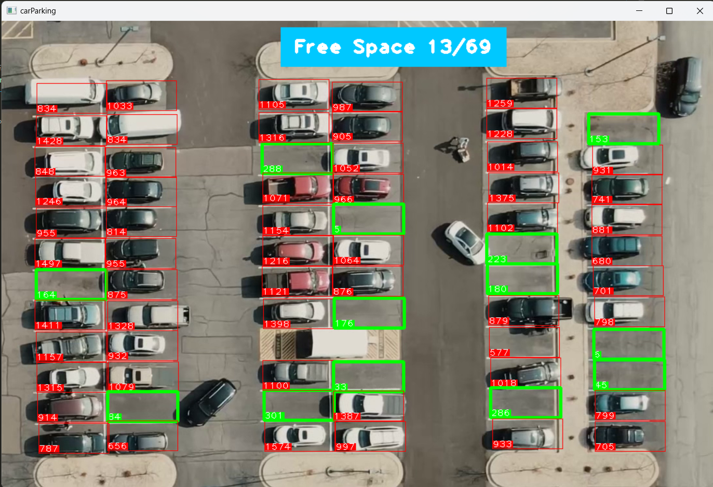

# Car Parking Space Counter

## Description

The Car Parking Space Counter is a project designed to calculate the number of available parking spaces using computer vision techniques. By leveraging OpenCV and CVZone's Haar Cascade algorithm, the system provides real-time monitoring and management of parking occupancy, significantly enhancing efficiency and convenience for users.

The system detects and counts parked vehicles, providing instant feedback on available spaces. This technology is particularly useful for large parking areas, making it easier to manage and utilize parking resources effectively.

## Repository Link

Explore the codebase on GitHub: [Car Parking Space Counter](https://github.com/yashchinchole/Car-Parking-Space-Counter)

## Features and Key Points

- **Real-time Monitoring**: Provides instant updates on parking space availability.
- **Efficient Management**: Enhances the efficiency of parking space utilization.
- **User Convenience**: Improves user experience by providing up-to-date information on parking occupancy.
- **Accurate Detection**: Utilizes advanced computer vision algorithms for precise vehicle detection and counting.
- **Scalable Solution**: Suitable for various sizes of parking facilities, from small lots to large multi-story structures.

## Screenshots

## Technologies Used

- Python
- OpenCV
- CVZone
- NumPy

## Proposed Methodology

### 1. Image Acquisition

The system captures images or video feeds from surveillance cameras monitoring the parking area.

### 2. Preprocessing

Captured images are preprocessed using OpenCV to enhance quality and remove noise. This step may involve converting images to grayscale, smoothing, and applying filters.

### 3. Vehicle Detection

Using CVZone's Haar Cascade algorithm, the system detects vehicles in the parking area. The algorithm identifies vehicle shapes and distinguishes them from the background.

### 4. Parking Space Identification

The system identifies individual parking spaces within the monitored area. This involves marking the boundaries of each space and associating detected vehicles with these spaces.

### 5. Counting and Feedback

The system counts the number of occupied and available parking spaces. Real-time feedback is provided to users, often displayed on a dashboard or an app.

